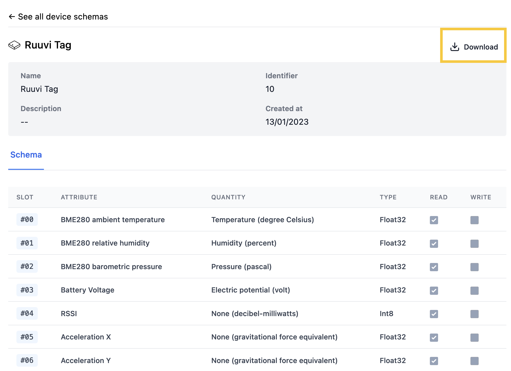

# hyper-python-sdk

Python SDK for interacting with the Hyper.systems platform.

## Installing

Install the latest version globally using pip:

```shell
pip install -U hyper-systems
```

### Adding as a dependency to your project

Add to `requirements.txt` for pip:

```shell
echo "hyper-systems==1.1.3" >> requirements.txt
```

Consider using [venv](https://docs.python.org/3/tutorial/venv.html), if you want to have an isolated environment for your project with pip.

Alternatively, install with poetry:

```shell
poetry add "hyper-systems==1.1.3"
```

### Installing the latest development version of the package globally

```shell
$ pip install -U git+https://github.com/hyper-systems/hyper-python-sdk.git@master
```

## Using this repo for development

This repo uses [poetry](https://python-poetry.org/) (please check the [docs](https://python-poetry.org/docs/)) for development and building. It is currentlu set up to create a `.venv` directory in the root of this project on install.


Installing the environment:

```shell
$ poetry install
```

### Shell usage

After installing you can use the environment created with poetry, for example to:

- update the environment:

```shell
$ poetry update
```

- execute scripts:

```shell
$ poetry run tests/test_devices.py
```

### VSCode

You can also use the environment in VSCode by opening one of the python files in this repo and selecting the poetry python interpreter in the bottom left corner (`('.venv': poetry)`). You then reload the VSCode window (or open and close VSCode) and VSCode should be now using the `.venv` environment created by poetry.

## Usage

The first thing we need to do to start using the Python SDK is provide a valid API key. This will allow the library to make requests to Hyper's services for publishing and receiving messages.

You can obtain an API key from your hyper.systems dashboard instance. In the sidebar, click on your account name, select "Account", go to the "API Keys" section.

In additon to the API settings, you need to specify a site identifier. Sites can be helpful to namespace devices and messages across different physical locations.

```python
HYPER_API_KEY = "<insert your key here>"
HYPER_API_URL = "https://<your organization name>.hyper.systems/api"
HYPER_SITE_ID = 1
```


### Creating a device schema

Before you can start publishing messages from your device, we need to provide the attribute schema for your device.

The schema can be obtained from your hyper.systems dashboard.



Download the JSON schema file and place it somewhere in your project directory.

```python
from hyper_systems.devices import Device, Schema
from hyper_systems.http import Client

# Load the device schema.
SCHEMA_FILE = "<path to downloaded schema file>"
schema = Schema.load(SCHEMA_FILE)

# Initialize the device with a schema and a unique id.
device_id = "00:00:00:00:00:01"
device = Device.from_schema(schema, device_id)
```

The device schema contains the full description of the properties of the device. Note that multiple devices can match the same device schema as long as they have different device ids.

> Note: You can can inspect the schema files to see the metadata and the available attributes.

The device is now ready to be used to start recording values.


### Recording device values

The `device` object we created in the previous section has setters for every attribute from the device schema. We can start recording values for the attributes of the device.

```python
# Print the list of all available attributes.
print(device.attributes)
```

This will give you the list of available property names. For example, if the list above contains a property called "sht31_relative_humidity_1", you can set the value for this attribute with:

```python
# The the value of the attribute.
device.sht31_relative_humidity_1 = 55.0
```

> Note: The `_1` suffix in the attribute name is the unique slot of the attribute in the device schema.

Alternatively, the attribute values can be set by specifying their slot. The following sets the value for the `sht31_relative_humidity_1` attribute using its slot.

```python
# Set attribute values using the attribute slot.
device[1] = 60.0
assert device[1] == 60.0
```

You can set any attribute values available on the device. Setting all attributes is not required.


### Publishing device values

Once your device is initialized and has the attribute values set, you can publish them to the hyper.systems platform.

```python
hyper_client = Client(
    api_url=HYPER_API_URL,
    api_key=HYPER_API_KEY,
    site_id=HYPER_SITE_ID
)
hyper_client.publish_device_message(device.message)
```
